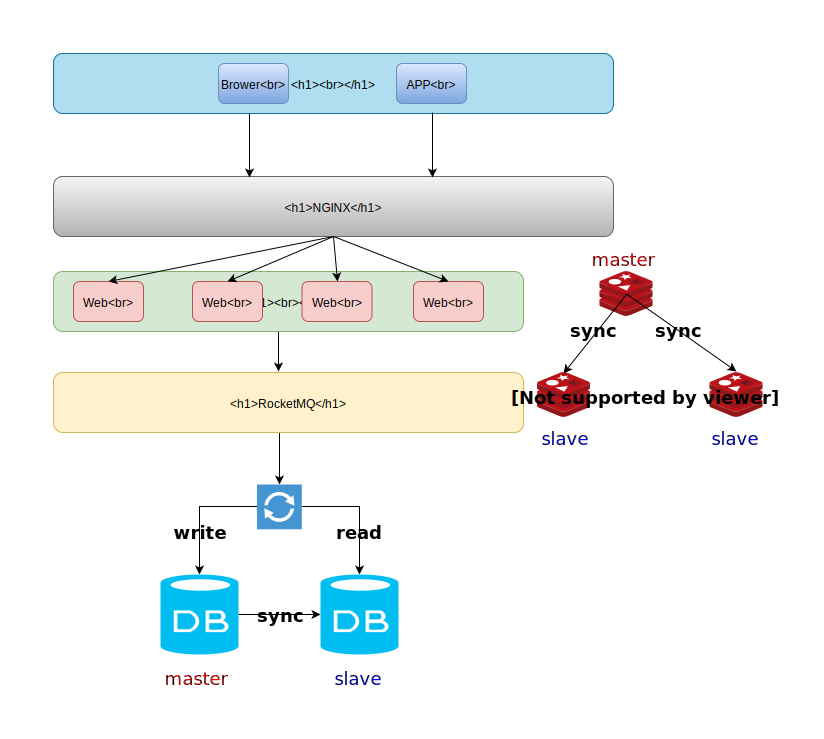

# SecKillSystem

> 由于学校网络中心出问题了，第一个项目原来的域名暂时访问不了，然后自己新开了一个URL：[https://jinshuai86.github.io/EtrizDoc](https://jinshuai86.github.io/EtrizDoc)

SecKillSystem是一个基于SpringBoot的商品秒杀模块。

## 服务端设计思路
瓶颈是数据库处理请求的能力。大量请求打到数据库以后，由于数据库处理请求能力有限，会造成超时或者宕机等。所以思路就是尽量将请求拦截在系统上游  
- 对于读多(**读库存**)写少(**创建订单**)的应用，多使用缓存(对于查询库存操作通过缓存实现，减少数据库操作)
- 缓存、应用、数据库做集群，做负载均衡;消息异步处理
- 前台可以通过`js`对正常用户的操作做一些限制、用`CDN`和用户浏览器缓存一些静态资源

### [压力测试结果👉](./JMeter/results/result.md)

### 整体架构


### 秒杀流程
#### 1 判断用户是否重复购买  
将用户id和产品id组合起来放到Redis集合中，当用户请求打过来时，判断Redis集合中是否存在userId + ":" + productId，**注意:一定要加分隔符，因为如果不加分隔符，1 + 23 和 12 + 3效果一样。**
```Java
/**
 * 是否重复购买
 *
 */
private void checkRepeat(long userId, long productId) throws SecKillException {
    Jedis jedis = jedisContainer.get();
    // 将用户Id和商品Id作为集合中唯一元素
    String itemKey = constructCacheKey(userId, productId);
    if (jedis.sismember(SHOPPING_ITEM, itemKey)) {
        throw new SecKillException(StatusEnum.REPEAT);
    }
}
```

#### 2 判断用户请求次数是否已达上限  
通过分布式锁结合Redis实现分布式限流，这里用的基于Redis实现的分布式锁和基于Redis的计数器。 思路是：将用户标识作为Redis中的一个可以过期的String，每次用户请求会判断，该用户请求的次数是否已经达到上限
```Java
/**
 * 限制用户请求频率
 * 指定时间(requestDuration)内请求次数不能超过requestTimes次
 *
 */
private void limitRequestTimes(long userId) throws SecKillException {
    Jedis jedis = jedisContainer.get();
    // 每个用户的请求标识
    String itemKey = constructCacheKey(USER_LIMIT, userId);
    String clientId = clientIdContainer.get();
    try {
        RedisUtil.tryGetDistributedLock(jedis, USER_LIMIT_LOCK, clientId, lockExpire);
        // 已经请求的次数
        String reqTimes = jedis.get(itemKey);
        // 第一次请求：设置初始值
        if (reqTimes == null) {
            jedis.set(itemKey, "1");
            jedis.expire(itemKey, requestDuration);
        } else if (Long.parseLong(reqTimes) >= requestTimes) { // 限速
            throw new SecKillException(StatusEnum.FREQUENCY_REQUEST);
        } else { // 还没超过限制次数，请求次数加1
            jedis.incr(itemKey);
        }
    } catch (InterruptedException e) {
        log.error("thread is interrupted when get distributed lock", e);
        throw new SecKillException(StatusEnum.SYSTEM_EXCEPTION);
    } finally {
        RedisUtil.releaseDistributedLock(jedis, USER_LIMIT_LOCK, clientId);
    }
}
```

#### 3 查库存
查库存可能会出现缓存穿透，如果查询到缓存中不存在的值，就会去数据库中查找。如果频繁遇到这种情况，一直访问数据库，那缓存也就没多大效果了。解决办法是如果缓存中不存在请求的key，那缓存就缓存下这个key，然后向上抛异常。
```Java
/**
 * 检查缓存库存、处理缓存穿透
 *
 */
private void checkStock(long productId) throws SecKillException {
    Jedis jedis = jedisContainer.get();
    String cacheProductKey = constructCacheKey("product", productId, "stock");
    String cacheProductStock = jedis.get(cacheProductKey);
    // 命中无意义数据
    if (PENETRATION.equals(cacheProductStock)) {
        throw new SecKillException(StatusEnum.INCOMPLETE_ARGUMENTS);
    }
    // 缓存未命中
    if (cacheProductStock == null) {
        Product product = productDao.getProductById(productId);
        // 数据库不存在此商品
        if (product == null) {
            // 通过缓存没意义的数据防止缓存穿透
            jedis.set(cacheProductKey, PENETRATION);
            throw new SecKillException(StatusEnum.INCOMPLETE_ARGUMENTS);
        } else {
            cacheProductStock = String.valueOf(product.getStock());
            jedis.set(cacheProductKey, cacheProductStock);
            jedis.expire(cacheProductKey, expire);
        }
    }
    // 库存不足
    if (Long.valueOf(cacheProductStock) == 0) {
        throw new SecKillException(StatusEnum.LOW_STOCKS);
    }
}
```

#### 4 更新库存
需要处理缓存和数据库双写时的数据一致性问题  
##### 方案一：先删除缓存，然后更新数据库 ×
可能**长时间**出现脏读：当线程t1先删除缓存以后，此时线程t2从缓存中读取库存，因为t1已经删除缓存了，t2会从数据库中重新读到缓存中，当t1更新数据库以后，缓存和数据库中的库存不一致。缓存中存的**一直**是脏数据

##### 方案二：先更新数据库，然后删除缓存(Cache Aside Pattern) √
可能**短时间**出现脏读：当t1更新数据库以后，此时t2读取缓存中的数据，读到的是脏数据，然后t1删除缓存。后续读到的都是最新的数据。  
小概率**长时间**出现脏读：当t1读取缓存时，由于之前某个线程已经删除了缓存，所以t1需要到数据库中读取，此时t2更新数据库，更新完以后，t1读到的就成了脏数据，当t2 “删除”缓存以后，t1将脏数据加到缓存中。导致缓存中存的**一直**是脏数据。
> 小概率是因为写操作通常是比较慢的，并且这种情况出现的前提是读操作需要在写操作之前开始（写操作需要加锁），所以一般写操作会在读操作完成之后。当t1将脏数据读到缓存中以后，当t2完成写操作，会重新删除掉缓存。

具体实现：  
```Java
/**
 * 扣库存、删除缓存
 *
 */
private void updateStock(Product product) throws SecKillException {
    Jedis jedis = jedisContainer.get();
    String cacheProductStockKey = constructCacheKey("product", product.getId(), "stock");
    // 更新数据库商品库
    if (product.getStock() == 0) {
        throw new SecKillException(StatusEnum.LOW_STOCKS);
    } else {
        int count = productDao.updateStockByOptimisticLock(product);
        if (count != 1) {
            throw new SecKillException(StatusEnum.SYSTEM_BUSY);
        } else {
            jedis.del(cacheProductStockKey);
        }
    }
}
```

##### 方案三：先更新数据库，然后更新缓存
会出现并发修改缓存错误：比如t1更新数据库库存之前，**假如**原库存为`2`,t1需要将更新后的库存`1`回写到缓存中。当t2也更新库存从`1`更新到`0`，也需要回写到缓存。此时如果t2先更新  
个人看法：用Redis做缓存的话，可以更新缓存。因为Redis是单线程操作，通过一些原子指令可以保证线程安全(`decr(...)`)，而其它的缓存比如memcache支持多线程，会存在并发修改错误

##### 方案四：先更新缓存，然后更新数据库
同方案三  
具体实现：
```java
private void updateStock(Product product) throws SecKillException {
    Jedis jedis = jedisContainer.get();
    int productId = product.getId();
    String cacheProductStockKey = constructCacheKey("product", product.getId(), "stock");
    // 更新缓存库存
    long currentCacheStock = jedis.decr(cacheProductStockKey);
    // 防止并发修改导致超卖
    if (currentCacheStock < 0) {
        jedis.set(cacheProductStockKey,String.valueOf(0));
        throw new SecKillException(StatusEnum.LOW_STOCKS);
    } else {
        // 更新数据库商品库存
        int count = secKillDao.updateStockByOptimisticLock(product);
        if (count != 1) {
            // 更新数据库商品库存失败，回滚之前修改的缓存库存
            jedis.incr(cacheProductStockKey);
            throw new SecKillException(StatusEnum.LOW_STOCKS);
        }
    }
}
```

#### 5 订单入队列
对每一个订单加上唯一标识，消费者消费时根据订单的唯一标识，查询是否已经消费了这个订单。[RocketMQ不建议用MessageID，因为MessageID可能会冲突(重复)。](https://help.aliyun.com/document_detail/44397.html?spm=a2c4g.11174283.6.651.3102449czbJGKh)
```Java
/**
 * 订单入队列
 *
 */
private void createOrder(Product product, long userId) throws SecKillException {
    User user = userDao.getUserById(userId);
    if (user == null) {
        throw new SecKillException(StatusEnum.INCOMPLETE_ARGUMENTS);
    }
    Jedis jedis = jedisContainer.get();
    Timestamp ts = new Timestamp(System.currentTimeMillis());
    Order order = new Order(user, product, ts, IdUtil.nextId());
    // 缓存用户购买记录，避免同一用户对同一商品重复购买
    String clientId = clientIdContainer.get();
    try {
        RedisUtil.tryGetDistributedLock(jedis, SHOPPING_ITEM_LOCK, clientId, lockExpire);
        String itemKey = constructCacheKey(user.getId(), product.getId());
        if (jedis.sismember(SHOPPING_ITEM, itemKey)) {
            throw new SecKillException(StatusEnum.REPEAT);
        } else {
            jedis.sadd(SHOPPING_ITEM, itemKey);
        }
    } catch (InterruptedException e) {
        log.error("thread is interrupted when get distributed lock", e);
        throw new SecKillException(StatusEnum.SYSTEM_EXCEPTION);
    } finally {
        RedisUtil.releaseDistributedLock(jedis, SHOPPING_ITEM_LOCK, clientId);
    }
    // TODO MQ事务消息
    orderProducer.product(order);
}
```

#### 6 消费者消费订单，最终保存到数据库
消费时先根据这条订单的唯一标识在Redis中查找，判断是否已经消费过这条订单，如果没有的话，将这个订单的唯一标识添加到Redis集合中。将订单持久到数据库中
```Java
public void consume(Order order) {

    try (Jedis jedis = jedisSentinelPool.getResource()) {
        // 获取分布式锁
        String requestId = UUID.randomUUID().toString();
        RedisUtil.tryGetDistributedLock(jedis, LOCK_KEY, requestId, lockExpire);

        // 已经消费过此条消息
        String orderIdStr = String.valueOf(order.getOrderId());
        if (jedis.sismember("order:message:id", orderIdStr)) {
            log.error("消息[{}]已经被消费", order);
            return;
        }
        // 添加这条订单的唯一业务标识到Redis中
        jedis.sadd("order:message:id", orderIdStr);

        // 释放【当前客户端】持有的锁
        RedisUtil.releaseDistributedLock(jedis, LOCK_KEY, requestId);

        orderDao.createOrder(order);
        log.info("订单出队成功，当前创建订单总量 [{}]", orderNums.addAndGet(1));
    } catch (Exception e) {
        log.error("订单[{}]出队异常", order, e);
    }
}
```

# 部分技术实现
## MySQL主从复制、读写分离
- MySQL主从复制在数据库层面实现即可
- 读写分离
  - 读写分离的最终效果是：在访问数据库时，在业务端决定它应该用哪个数据源。对于只读操作就访问从数据库，对于写操作就访问主库。
  - Spring中内置了一个`AbsractRoutingDataSource`类，它内部维护了一个Map`private Map<Object, Object> targetDataSources;`用来存放多个数据源，可以根据不同的key从Map中获取不同的数据源。所以只要重写它通过key来查找目标数据源的方法，用我们预期的key来获取目标数据源即可。
  - 需要继承`AbsractRoutingDataSource`将创建的目标数据源放到它维护的Map中，然后重写它通过key来查找目标数据源的方法`protected abstract Object determineCurrentLookupKey();`。将它要用的key在执行方法前通过AOP提前放到ThreadLocal中，执行`determineCurrentLookupKey()`时通过ThreadLocal存放的值作为key查找Map里的数据源。
    - 将预期的key放到注解中，注解修饰特定的方法，通过Sping AOP在执行方法前获取注解里的key，放到`ThreadLocal`中，

# 进度
## Finished
- [x] 通过Redis实现缓存，每次查询库存都从Redis进行查找(注意缓存雪崩和缓存穿透)
- [x] 通过Redis复制以及哨兵机制实现了缓存高可用
- [x] 使用RocketMQ作为消息队列进行流量削峰
- [x] SpringBoot(SSM)作为整个项目的框架，**个人感觉**相比SpringDataJPA，MyBatis更灵活一些
- [x] MySQL持久化数据，分别采用乐观锁、悲观锁进行并发控制并通过JMeter进行性能测试。
- [x] 结合MySQL主从复制特性，在应用层通过AOP实现了读写分离
- [x] 通过MyCat代理实现读写分离
- [x] 通过snowflake生成消息唯一ID，基于Redis实现分布式锁保证集群模式下的消费幂等性

## TODO
- [ ] 存在大量硬编码
- [ ] 分布式集群(比如MySQL、Redis、~~SpringBoot、Nginx进行负载均衡~~)
- [ ] 解决MySQL主从复制带来的数据不一致性问题
- [ ] 每次只放指定数量的请求到消息队列，等处理完毕再重新拉请求入队列。
