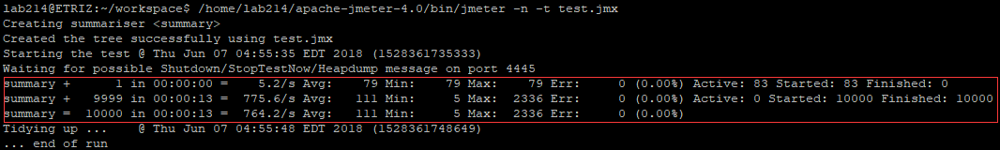

## 10000并发量测试结果
  > 测试脚本环境：E3-1230 v5 @ 3.40GHz X4  8G RAM  
  > 项目运行环境：i5-4200m X1 8G RAM

|并发控制|Avg|Min|Max|
|:-----:|:-:|:-:|:-:|
|悲观锁(未使用缓存)X1|5733|11|16961
|悲观锁(未使用缓存)X2|6044|10|17806
|悲观锁(未使用缓存)X3|6593|10|19206
|悲观锁(未使用缓存)X4|7871|11|20255
|乐观锁(未使用缓存)X1|3176|5|11399
|乐观锁(未使用缓存)X2|2594|6|9521
|乐观锁(未使用缓存)X3|5312|7|13707
|乐观锁(使用Redis缓存)X1|96|6|1322
|乐观锁(使用Redis缓存)X2|111|5|2336
|乐观锁(使用Redis缓存)X3|736|7|3545

## 悲观锁结果

## 乐观锁结果  

## 乐观锁&&缓存结果  
  